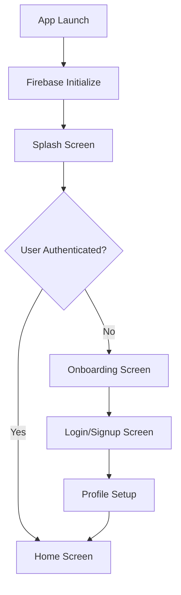
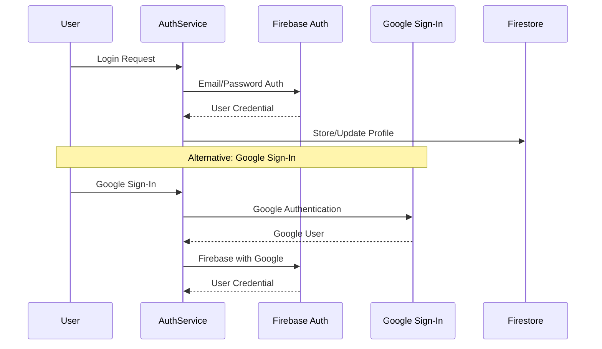
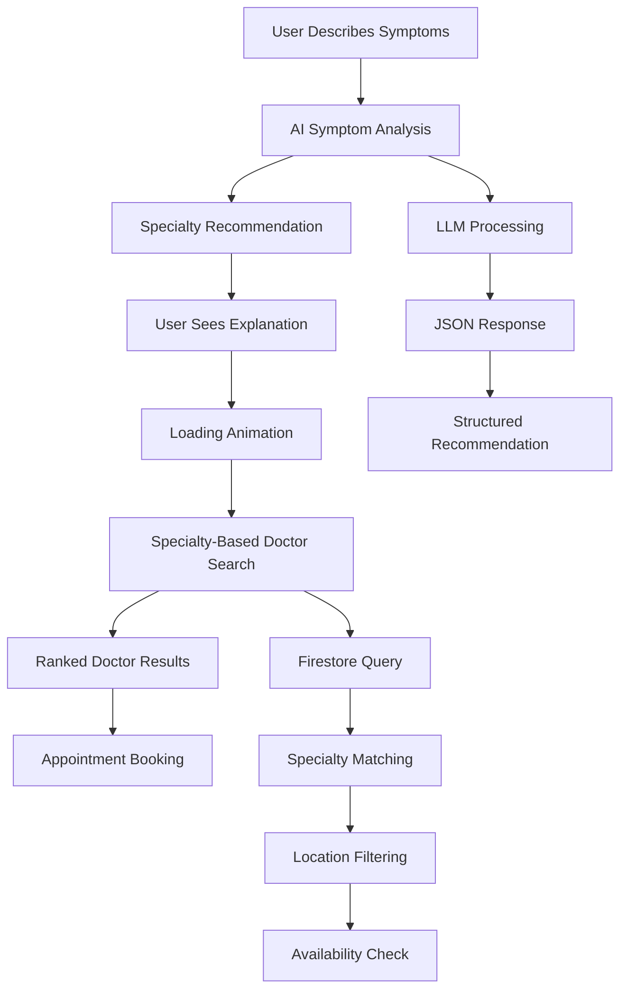
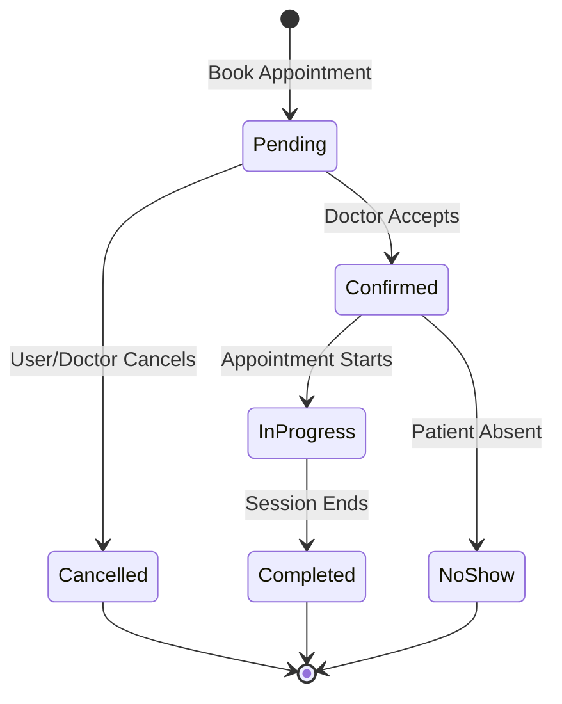
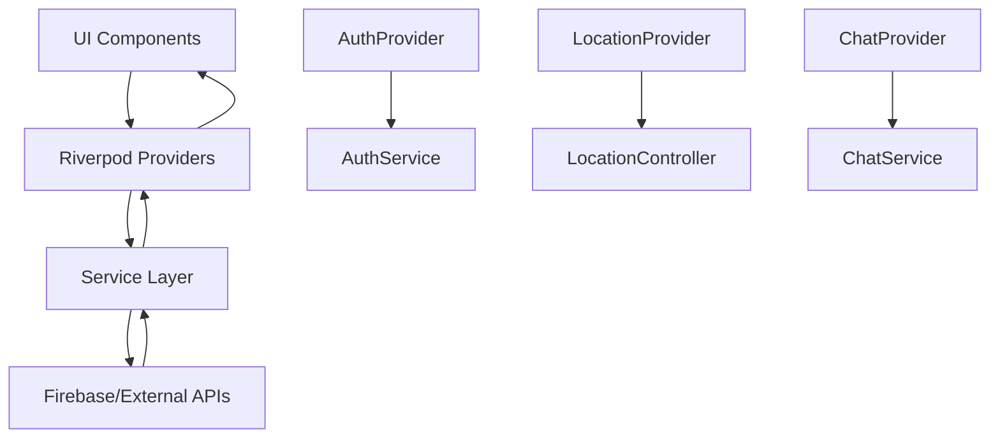

# 📱 DocLinker App Architecture & Feature Flow Documentation

## 🎯 **App Overview**

DocLinker is a comprehensive Flutter-based healthcare application that connects patients with doctors through an intelligent medical assistant powered by AI. The app provides appointment booking, medical consultation assistance, doctor discovery, and healthcare management features.

### **Core Technologies:**
- **Frontend:** Flutter with Riverpod state management
- **Backend:** Firebase (Firestore, Authentication)
- **AI/ML:** Groq API with Gemma2-9b-it LLM model
- **Authentication:** Firebase Auth + Google Sign-In
- **Database:** Cloud Firestore
- **Location:** Geolocation services for nearby doctor discovery

---

## 🏗️ **Application Architecture**

### **Project Structure:**
```
lib/
├── main.dart                 # App entry point with Firebase initialization
├── app_theme.dart           # Centralized theme configuration
├── firebase_options.dart    # Firebase configuration
│
├── controllers/             # Business logic controllers
│   └── location_controller.dart
│
├── models/                  # Data models
│   ├── appointment.dart     # Appointment management models
│   ├── doctor_profile.dart  # Doctor profile and specializations
│   └── user_profile.dart    # Patient profile models
│
├── pages/                   # Main application pages
│   ├── assistant_page.dart  # AI medical assistant (dual chat modes)
│   ├── appointments_page.dart # Appointment management
│   ├── history_page.dart    # Medical history and past consultations
│   └── nearby_page.dart     # Location-based doctor discovery
│
├── providers/               # Riverpod state providers
│   └── auth_provider.dart   # Authentication state management
│
├── screens/                 # Auth and setup screens
│   ├── splash_screen.dart   # App initialization
│   ├── onboarding_screen.dart # First-time user onboarding
│   ├── login_screen.dart    # User authentication
│   ├── signup_screen.dart   # User registration
│   ├── home_screen.dart     # Main app shell
│   └── doctor/              # Doctor-specific screens
│       ├── doctor_dashboard.dart
│       ├── doctor_profile_screen.dart
│       └── doctor_appointments_screen.dart
│
├── services/                # External service integrations
│   ├── auth_service.dart    # Firebase Authentication
│   ├── chat_service.dart    # Groq AI/LLM integration
│   ├── doctor_matching_service.dart # AI-powered doctor matching
│   └── embedding_service.dart # Vector embeddings for similarity
│
├── utils/                   # Utility functions and helpers
│   └── safe_provider_access.dart # Safe Riverpod provider access
│
└── widgets/                 # Reusable UI components
    ├── main_layout.dart     # App shell with navigation
    ├── bottom_nav_bar.dart  # Bottom navigation
    ├── enhanced_chat_bubble.dart # Chat interface with loading
    ├── ai_avatar.dart       # AI assistant visual representation
    ├── ai_progress_tracker.dart # Multi-step process indicator
    └── enhanced_voice_button.dart # Voice input functionality
```

---

## 🔄 **Application Flow & Navigation**

### **1. App Initialization Flow**



#### **Entry Points:**
1. **`main.dart`** - Firebase initialization and app bootstrap
2. **`SplashScreen`** - App loading and auth state check
3. **`OnboardingScreen`** - First-time user introduction
4. **`LoginScreen/SignUpScreen`** - Authentication flow
5. **`HomeScreen`** - Main application shell

---

## 🔐 **Authentication System**

### **Authentication Flow:**



### **Key Features:**
- **Email/Password Authentication** via Firebase Auth
- **Google Sign-In** integration with proper error handling
- **User Profile Management** with Firestore synchronization
- **Authentication State Management** via Riverpod providers
- **Role-based Access** (Patient vs Doctor accounts)

### **Service Components:**
- **`AuthService`** - Handles all authentication operations
- **`AuthProvider`** - Riverpod state management for auth state
- **Google Play Services** validation and availability checks

---

## 🤖 **Medical Assistant & AI Integration**

### **Dual Chat Mode System:**

The assistant page supports two distinct modes:

#### **1. Simple Chat Mode**
- General health information and questions
- Powered by Groq AI (Gemma2-9b-it model)
- Health tips and DocLinker information

#### **2. Find Doctor Mode (Enhanced Medical Assistant)**
- **AI-powered symptom analysis** with specialty recommendations
- **Structured medical workflow** with loading feedback
- **Specialty-based doctor matching** algorithm

### **Find Doctor Workflow:**



### **Medical Assistant Features:**

#### **Symptom Analysis Engine:**
```dart
// AI-powered specialty recommendation
static Future<SpecialtyRecommendation> analyzeSymptomsAndSuggestSpecialties(String symptoms) {
  // LLM prompt engineering for medical specialty matching
  // Structured JSON response with explanation, condition, and specialties
  // Fallback keyword-based matching for reliability
}
```

#### **Specialty-Based Doctor Matching:**
- **Primary Matching:** Exact specialty match
- **Secondary Matching:** Related specialty search
- **Tertiary Matching:** General medicine fallback
- **Location-based Filtering:** Geographic proximity
- **Availability Scoring:** Real-time availability check

#### **Loading Animation System:**
- **Enhanced Chat Bubble** with `isLoading` state
- **Three-dot Pulsing Animation** during doctor search
- **Progress Tracking** with multi-stage indicators
- **User Feedback** with "Finding Best Doctor For You..." message

---

## 🏥 **Doctor & Appointment Management**

### **Doctor Profile System:**

#### **Doctor Profile Model:**
```dart
class DoctorProfile {
  // Basic Information
  final String uid, email, fullName, phoneNumber;
  final String profileImageUrl;
  
  // Medical Credentials
  final String medicalLicense;
  final List<String> specializations;
  final String hospitalAffiliation;
  final int yearsOfExperience;
  final List<String> certifications;
  
  // Availability & Pricing
  final Map<String, List<String>> weeklyAvailability;
  final double consultationFee;
  final bool isAvailableForEmergency;
  
  // Location & Contact
  final String clinicAddress;
  final double latitude, longitude;
  
  // Verification & Status
  final bool isVerified, isActive;
  final ProfileCompletionStatus completionStatus;
}
```

### **Appointment Management System:**

#### **Appointment Lifecycle:**


#### **Key Features:**
- **Multi-status Tracking:** Pending, Confirmed, In Progress, Completed, Cancelled, No Show
- **Appointment Types:** Consultation, Follow-up, Emergency, Check-up, Procedure
- **Payment Integration:** Fee tracking and payment status
- **Real-time Updates:** Status synchronization across doctor and patient apps
- **Notification System:** Appointment reminders and status changes

---

## 🎨 **UI Architecture & Navigation**

### **Main Layout Structure:**

```dart
class MainLayout extends ConsumerStatefulWidget {
  // App shell with:
  // - TopBar (notifications, profile access)
  // - IndexedStack for page management
  // - BottomNavBar (4 main sections)
  // - Profile menu modal
}
```

#### **Navigation Structure:**
```
HomeScreen (Main App Shell)
├── AssistantPage (Index 0)
│   ├── Simple Chat Mode
│   └── Find Doctor Mode (Enhanced Medical Assistant)
├── AppointmentsPage (Index 1)
│   ├── Upcoming Appointments
│   ├── Past Appointments
│   └── Book New Appointment
├── HistoryPage (Index 2)
│   ├── Medical History
│   ├── Past Consultations
│   └── Prescription History
└── NearbyPage (Index 3)
    ├── Location-based Doctor Search
    ├── Hospital Directory
    └── Emergency Services
```

### **Responsive Design System:**

#### **Theme Architecture:**
```dart
class AppTheme {
  // Color Scheme
  static const primaryColor = Color(0xFF2E7D8F);
  static const secondaryColor = Color(0xFF4A90A4);
  static const backgroundColor = Color(0xFFF8FAFC);
  
  // Typography
  static TextTheme get textTheme;
  
  // Component Themes
  static ButtonThemeData get buttonTheme;
  static InputDecorationTheme get inputTheme;
}
```

#### **Responsive Components:**
- **Screen Size Detection:** Automatic UI scaling based on device dimensions
- **Flexible Layouts:** Grid and flex systems adapt to screen constraints
- **Accessibility Support:** Screen reader compatibility and touch target sizing

---

## 🔧 **Service Layer Architecture**

### **1. ChatService (AI Integration)**

```dart
class ChatService {
  // Groq API integration for LLM communication
  static Future<String> sendMessage(String message);
  
  // Structured prompt engineering for medical assistance
  // Error handling and fallback mechanisms
  // Token usage optimization
}
```

### **2. DoctorMatchingService (Core Medical Logic)**

```dart
class DoctorMatchingService {
  // AI-powered symptom analysis
  static Future<SpecialtyRecommendation> analyzeSymptomsAndSuggestSpecialties();
  
  // Specialty-based doctor search
  static Future<DoctorMatchingResult> findDoctorsBySpecialties();
  
  // RAG-based similarity matching (legacy support)
  static Future<DoctorMatchingResult> findMatchingDoctors();
}
```

### **3. EmbeddingService (Vector Search)**

```dart
class EmbeddingService {
  // Vector embedding generation for semantic search
  static Future<List<double>> generateEmbedding(String text);
  
  // Similarity calculation between symptoms and doctor profiles
  static double calculateCosineSimilarity(List<double> a, List<double> b);
}
```

---

## 📊 **Data Flow & State Management**

### **State Management Pattern:**



### **Data Synchronization:**

#### **Real-time Updates:**
- **Firestore Streams** for appointment status changes
- **Authentication State Changes** via Firebase Auth streams
- **Location Updates** for nearby doctor discovery

#### **Offline Support:**
- **Firestore Offline Persistence** for appointment data
- **Local Storage** for user preferences and chat history
- **Sync on Reconnection** for seamless user experience

---

## 🚀 **Key Features & Workflows**

### **1. Enhanced Medical Assistant Workflow**

1. **Symptom Input:** User describes symptoms in natural language
2. **AI Analysis:** Groq LLM processes symptoms and suggests specialties
3. **Specialty Recommendation:** Structured explanation with relevant medical specialties
4. **Doctor Search:** Specialty-based matching with location and availability filtering
5. **Results Presentation:** Ranked doctors with booking options

### **2. Appointment Management Workflow**

1. **Doctor Selection:** From search results or nearby page
2. **Time Slot Selection:** Available appointment times
3. **Appointment Details:** Reason, symptoms, contact information
4. **Booking Confirmation:** Real-time status updates
5. **Appointment Tracking:** Status monitoring and reminders

### **3. Location-based Discovery**

1. **Location Permission:** GPS access for accurate positioning
2. **Nearby Search:** Geographic radius-based doctor discovery
3. **Hospital Directory:** Affiliated medical institutions
4. **Emergency Services:** Quick access to urgent care

---

## 🛡️ **Security & Privacy**

### **Data Protection:**
- **Firebase Security Rules** for user data isolation
- **Authentication-based Access Control** for sensitive operations
- **HIPAA-compliant Data Handling** for medical information
- **Encrypted Communication** via HTTPS/TLS

### **Privacy Measures:**
- **Minimal Data Collection** - only essential medical information
- **User Consent Management** for data usage and sharing
- **Secure Authentication** with multi-factor options
- **Data Retention Policies** for medical records and chat history

---

## 📈 **Performance & Optimization**

### **Performance Features:**
- **Lazy Loading** for large doctor lists and appointment history
- **Image Caching** for doctor profile photos
- **Firestore Query Optimization** with proper indexing
- **State Management Efficiency** via Riverpod's selective rebuilds

### **Scalability Considerations:**
- **Modular Architecture** for feature expansion
- **Service Layer Abstraction** for easy backend swapping
- **Widget Composition** for reusable UI components
- **API Rate Limiting** for external service management

---

## 🎯 **Future Enhancements**

### **Planned Features:**
1. **Video Consultation** integration
2. **Prescription Management** with pharmacy integration
3. **Insurance Verification** and claims processing
4. **Multi-language Support** for diverse user base
5. **Wearable Device Integration** for health monitoring
6. **Advanced AI Features** - diagnosis assistance and health insights

### **Technical Roadmap:**
- **Microservices Architecture** for backend scaling
- **GraphQL API** for efficient data fetching
- **Machine Learning Models** for personalized recommendations
- **Real-time Communication** via WebSocket for consultations

---

## 📱 **Development & Deployment**

### **Development Environment:**
- **Flutter SDK** with latest stable version
- **Firebase CLI** for backend management
- **VS Code/Android Studio** with Flutter extensions
- **Git Version Control** with feature branch workflow

### **Deployment Pipeline:**
- **Firebase Hosting** for web deployment
- **Google Play Store** for Android distribution
- **App Store Connect** for iOS distribution
- **Continuous Integration** via GitHub Actions or Firebase CI/CD

---

## 🎨 **Design System**

### **Visual Design Principles:**
- **Medical Theme:** Professional, clean, trustworthy design
- **Accessibility First:** WCAG compliance and inclusive design
- **Consistent Branding:** Unified color scheme and typography
- **Intuitive Navigation:** Clear information hierarchy and user flows

### **Component Library:**
- **Enhanced Chat Bubble** with loading animations
- **AI Avatar** with conversation states
- **Progress Trackers** for multi-step workflows
- **Doctor Cards** with comprehensive information display
- **Appointment Cards** with status indicators and actions

---

This documentation provides a comprehensive overview of the DocLinker app architecture, featuring flows, and technical implementation. The app successfully combines AI-powered medical assistance with traditional healthcare management features to create a complete patient-doctor interaction platform.